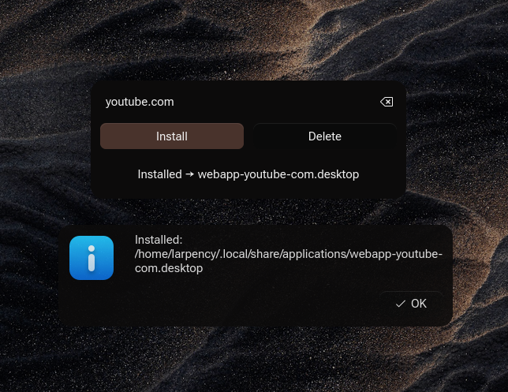
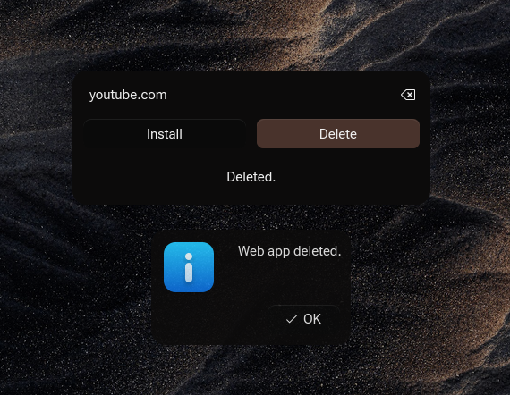
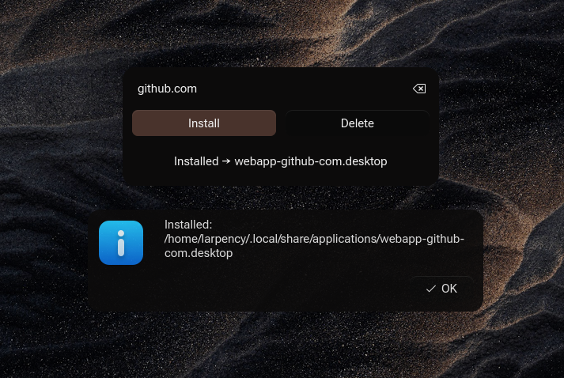
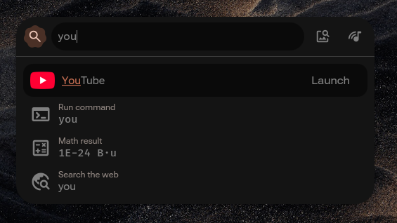

# WebApp Maker

Insanely simple Python + Qt6 utility to turn any URL into a desktop web app.

UI: a URL field + `Install` + `Delete`.

- **Install** creates `~/.local/share/applications/webapp-<slug>.desktop`
  that opens the URL in its own Chromium app window:
  `chromium --app="<url>" --user-data-dir="~/.local/share/webapps/<slug>"`
- **Delete** removes that launcher (+ icon + isolated profile).

App names are cleaned up automatically: `github.com` → **GitHub**,
`youtube.com` → **YouTube**, `mail.google.com` → **Gmail**, etc.

## Screenshots






## Install

```bash
git clone https://github.com/larpency/webapp-maker.git
cd webapp-maker
./install.sh
```

That's it. The script copies the app to `~/.local/share/webapp-maker`,
installs its only dependency (PySide6/Qt6 — via `uv` if you have it,
otherwise a `venv` + `pip`), and adds **WebApp Maker** to your app menu.
No sudo needed. Uninstall with `./install.sh --uninstall`.

Linux only. Browser support, in order of preference:

- **Chromium-family** (Chromium, Chrome, Brave, Edge, Opera, Vivaldi) —
  chromeless app window with isolated data (`--app`, preferred).
- **Firefox-family** (Firefox, ESR, Developer Edition, Floorp, Zen,
  LibreWolf, FireDragon, Waterfox) — own window with an isolated profile
  (`--no-remote -P ... --new-window`).
- Neither found — falls back to `xdg-open`.

Tips: stock Firefox can do chromeless windows too — set
`browser.ssb.enabled=true` in `about:config`, then `firefox --ssb <url>`.
Floorp users can also use its built-in Web Apps (Floorp Hub → Web Apps).

Headless / scriptable (no GUI):

```bash
webapp-maker --install github.com
webapp-maker --delete github.com
webapp-maker --name github.com   # -> GitHub
```

## Hack on it

```bash
uv sync        # creates .venv and installs PySide6 (Qt6)
uv run main.py
```

Requires Python 3.10+.

## System Qt colors

The app sets no style/stylesheet of its own — it uses whatever Qt style
your system specifies (`QT_STYLE_OVERRIDE`, e.g. Darkly/Breeze/kvantum).
Since the PySide6 wheel bundles its own Qt (which alone only knows
Windows/Fusion), `main.py` prepends `/usr/lib/qt6/plugins` to
`QT_PLUGIN_PATH` when that dir exists, so the bundled Qt can load your
distro's system styles and platform themes. No config needed.
